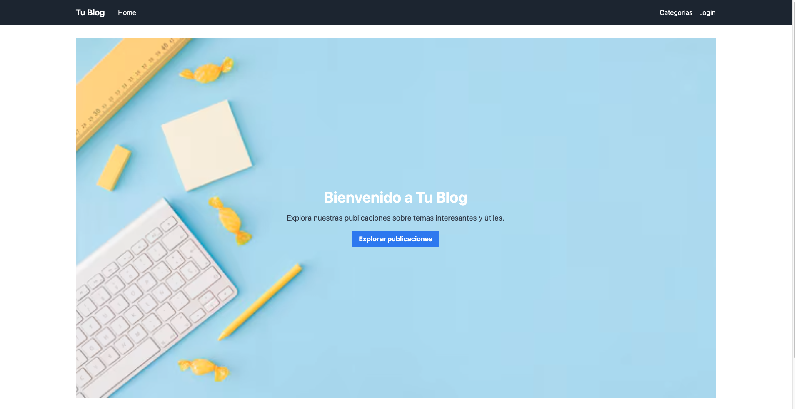
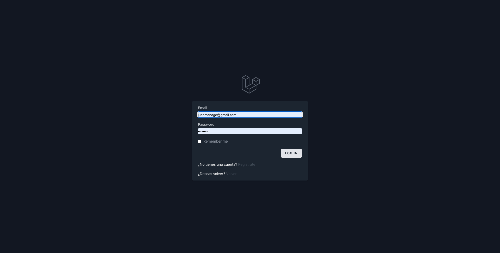
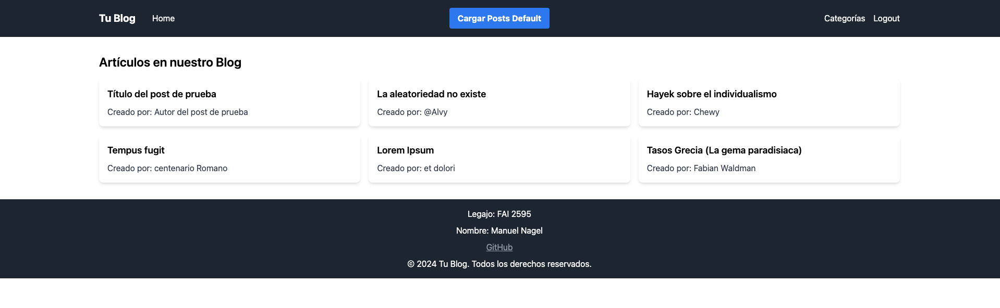
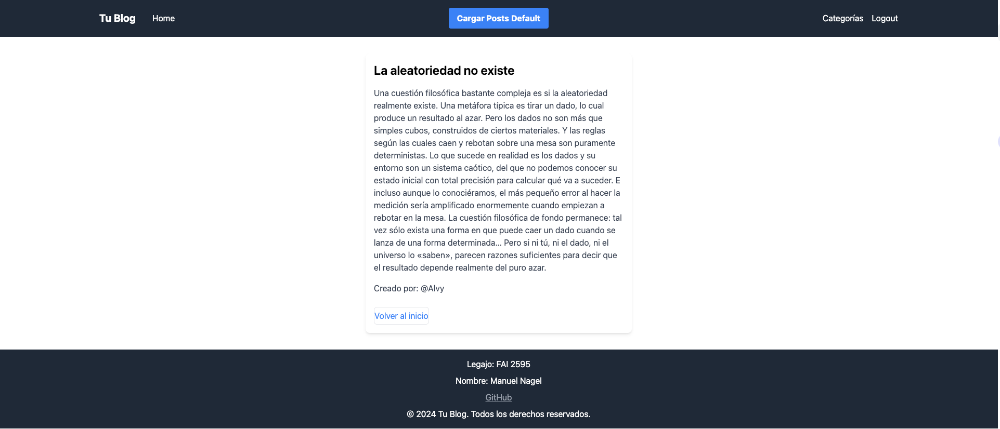

<h1>Integrantes del Equipo:</h1>
  <ul>
    <li><strong>Estudiante:</strong> Juan Manuel Nagel Sabio</li>
    <ul>
      <li><strong>Legajo:</strong> Fai - 2595</li>
    </ul>
  </ul>
    <h1>Tp myblog</h1>
    
 La definición de blog indica que es una página
web en la que se publican regularmente posts (artículos cortos) con contenido actualizado y
novedoso sobre temas específicos o libres. 

<h1>Funcionalidades</h1>

La aplicación cuenta con una página web de visualización de articulos con manejo de sesiones y un precargado de contenido. La página lista los articulos a ver y se pueden seleccionar indiviudalmente

<h2>Vistas</h2>
<ul>
    <li>Listar</li>
    <li>Show</li>
    <li>Home</li>
    <li>Login</li>
    <li>error</li>
  </ul>

  <h2>Guía de Instalación de la Aplicación:</h2>

Esta guía te ayudará a instalar y configurar la aplicación desde el repositorio.

<h3>Requisitos previos</h3>

Antes de comenzar, asegúrate de tener instalados los siguientes requisitos:

<ul>
    <li>PHP</li>
    <li>Composer</li>
    <li>Servidor de base de datos compatible con Laravel (MySQL, PostgreSQL, SQLite)</li>
    <li>Git</li>
</ul>

<h3>Pasos de instalación</h3>

<ol>
    <li>Clona el repositorio:</li>
    <li>git clone https://url-de-tu-repositorio.git</li>
    <li><strong>Accede al directorio del proyecto:</strong></li>
    cd nombre-de-tu-proyecto
    <li><strong>Instala las dependencias del proyecto utilizando Composer:</strong></li>
    composer install
    <li><strong>Crea un archivo .env basado en el archivo .env.example:</strong></li>
    cp .env.example .env
    <li><strong>Genera una nueva clave de aplicación:</strong></li>
    php artisan key:generate
    <li><strong>Configura tu base de datos en el archivo .env:</strong></li>
    
Abre el archivo .env en un editor de texto y configura los siguientes valores:

    <pre>
DB_CONNECTION=mysql 
DB_HOST=127.0.0.1 
DB_PORT=3306 
DB_DATABASE=nombre_de_tu_base_de_datos 
DB_USERNAME=nombre_de_usuario 
DB_PASSWORD=contraseña 
    </pre>
    <li><strong>Ejecuta las migraciones de la base de datos:</strong></li>
    php artisan migrate
    <li><strong>Inicia el servidor de desarrollo de Laravel:</strong></li>
    php artisan serve
    <li><strong>Accede a tu aplicación en tu navegador web:</strong></li>
    
Abre tu navegador web y visita http://localhost:8000 (o la URL proporcionada por el comando php artisan serve).

</ol>

Home:

Login: 

List:

Show:
