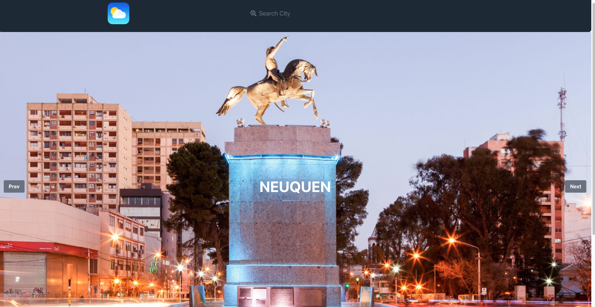
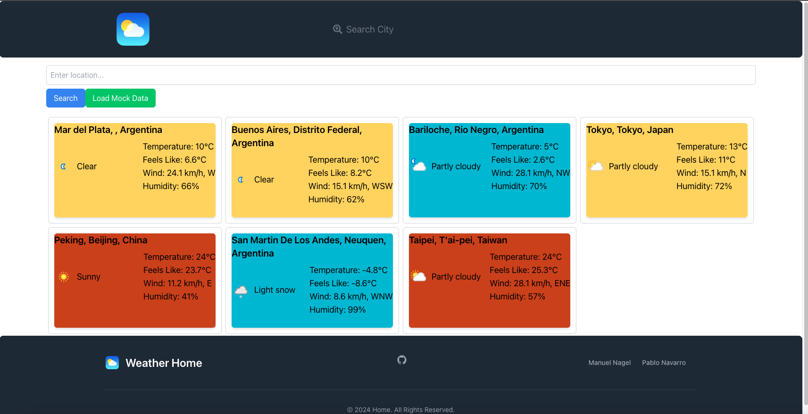
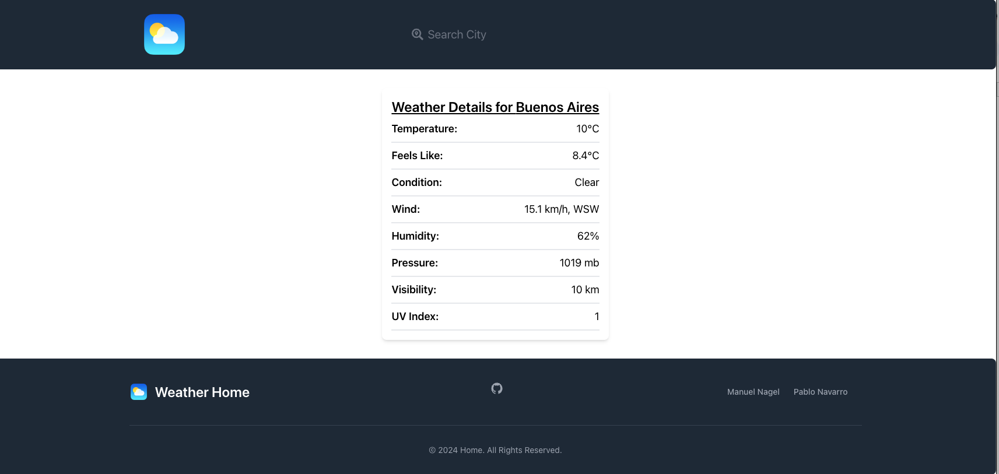

<h1>Integrantes del Equipo:</h1>
  <ul>
    <li><strong>Estudiante:</strong> Juan Manuel Nagel Sabio</li>
    <ul>
      <li><strong>Legajo:</strong> Fai - 2595</li>
    </ul>
    <li><strong>Estudiante:</strong> Pablo Navarro</li>
    <ul>
      <li><strong>Legajo:</strong> Fai - 4284</li>
    </ul>
  </ul>

  <h1>Aplicación de Pronóstico del Tiempo</h1>
  
La Aplicación de Pronóstico del Tiempo tiene como objetivo proporcionar pronósticos del tiempo para ciudades de todo el mundo, junto con detalles específicos sobre la ubicación seleccionada.

  <h1>Funcionalidades</h1>
  
La aplicación cuenta con un carrusel con títulos clickeables para ejecutar búsquedas automáticas de la ciudad clickeada. Además, la barra de navegación incluye un enlace a la vista/página de búsqueda de ciudades.

  
La vista/página de búsqueda de ciudades incluye una barra de búsqueda con varios parámetros posibles:

  <ul>
    <li>Latitud y Longitud (Grado Decimal) ej., <code>48.8567,2.3508</code></li>
    <li>Nombre de la Ciudad ej., <code>Paris</code></li>
    <li>Código Postal de EE. UU. ej., <code>10001</code></li>
    <li>Código Postal del Reino Unido ej., <code>SW1</code></li>
    <li>Código de Aeropuerto de 3 dígitos (IATA) ej., <code>iata:MDQ</code></li>
  </ul>
  
Al hacer clic en las tarjetas de ciudades se redirige a otra vista con una versión más detallada de la tarjeta.

  <h3>Guía de Instalación de la Aplicación:</h3>

  <h4>Requisitos Previos:</h4>
  
Asegúrate de tener Node.js instalado. Puedes descargarlo desde el <a href="https://nodejs.org/es/">sitio web de Node.js</a>.

  <h4>Pasos de Instalación:</h4>
  <ol>
    <li>Navega hasta el directorio de instalación deseado en la terminal.</li>
    <li>Clona el repositorio: <code>git clone https://github.com/manuelNagel/PWA.git</code></li>
    <li>Cambia al directorio del proyecto: <code>cd ./tp-react-2</code></li>
    <li>Instala las dependencias: <code>npm install</code></li>
    <li>Finalmente, inicia la aplicación: <code>npm start</code></li>
  </ol>

<h4>Capturas de Pantalla:</h4>

<strong>Home:</strong> 

<strong>Weather:</strong> 

<strong>Details:</strong> 
